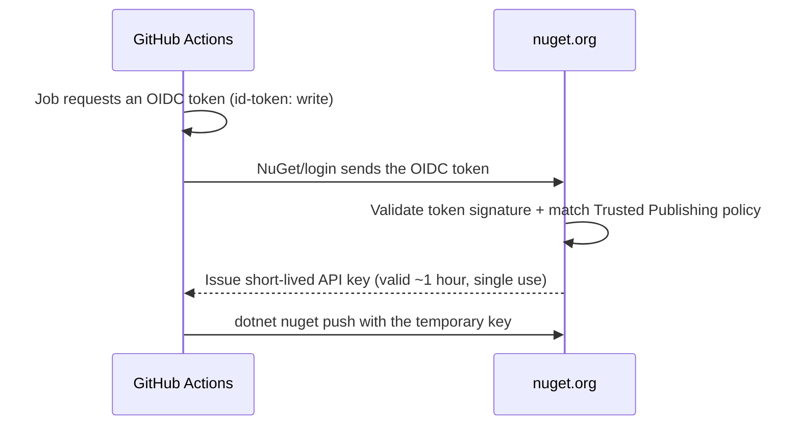

# Publishing

JsonLinq is published to [NuGet.org](https://www.nuget.org/) and to
[GitHub Packages](https://github.com/hard-rox/json-linq/packages) automatically
by the [`Build Test Pack Publish`](../.github/workflows/publish.yml) GitHub
Actions workflow whenever a version tag is pushed.

Publishing to NuGet.org uses **Trusted Publishing** — a keyless, OIDC-based flow.
There is **no long-lived NuGet API key** stored in the repository.

## How Trusted Publishing works

Instead of storing a secret API key, the workflow proves its identity to
NuGet.org using a short-lived, cryptographically signed OpenID Connect (OIDC)
token issued by GitHub Actions.



Key properties:

- The temporary API key is valid for about **1 hour** and can be used **once**,
  so the login step runs immediately before the push.
- Nothing sensitive is persisted; there is no key to rotate or leak.

## One-time setup

These steps have already been done for this repository, but are documented here
for reference and recovery.

### 1. Trusted Publishing policy on nuget.org

Log in to nuget.org → your username → **Trusted Publishing** → add a policy with:

| Field            | Value           |
| ---------------- | --------------- |
| Publisher        | `GitHubActions` |
| Repository Owner | `hard-rox`      |
| Repository       | `json-linq`     |
| Workflow         | `publish.yml`   |
| Environment      | `production`    |

> The **Workflow** value is the file name only (`publish.yml`), not the full
> `.github/workflows/publish.yml` path.

### 2. GitHub Actions `production` environment

Create an environment named `production` in the repository settings
(**Settings → Environments**). The workflow job declares `environment: production`,
which must match the `Environment` value in the nuget.org policy. You may add
protection rules (e.g. required reviewers) to gate releases.

### 3. `NUGET_USER` secret

Add a repository (or `production` environment) secret named `NUGET_USER` whose
value is your **nuget.org profile/username** — **not** your email address. The
`NuGet/login` action uses it when exchanging the OIDC token for a temporary key.

> The previous `NUGET_API_KEY` secret is no longer used and can be deleted.

## Cutting a release

The package version is taken directly from the Git tag.

1. Make sure `main` is green and contains everything you want to ship.
2. Create and push an annotated tag using the `vX.Y.Z` format:

   ```bash
   git tag -a v1.2.3 -m "Release 1.2.3"
   git push origin v1.2.3
   ```

3. The workflow triggers on the tag, builds with `-p:Version=1.2.3` (the tag
   with the leading `v` stripped), and publishes:
   - `JsonLinq 1.2.3` to NuGet.org
   - `JsonLinq 1.2.3` to GitHub Packages

Pre-release tags are supported, for example `v1.2.3-beta.1` produces package
version `1.2.3-beta.1`.

> The `<Version>` in [`JsonLinq.csproj`](../src/JsonLinq/JsonLinq.csproj) is only
> a local/dev default. CI overrides it with the tag version, so you do not need
> to bump the csproj before tagging.

## What the workflow does

The [`publish.yml`](../.github/workflows/publish.yml) workflow runs on tag pushes
(`v*`) and on manual `workflow_dispatch`:

1. **Checkout** and **Setup .NET**.
2. **Determine version** — if the ref is a `v*` tag, strips the `v` and validates
   the result is valid SemVer; otherwise marks the run as non-release.
3. **Restore**, **Build** (with `-p:Version=<tag>`), and **Test**.
4. **Pack** the NuGet package (with `-p:Version=<tag>`) into `./artifacts`.
5. **NuGet login (OIDC)** — exchanges the GitHub OIDC token for a short-lived key.
6. **Publish NuGet.org** — pushes primary `.nupkg` files with the temporary key (`--skip-duplicate --exclude-symbols`).
7. **Publish GitHub Packages** — pushes primary `.nupkg` files using the built-in `GITHUB_TOKEN` (`--exclude-symbols`).

The package is multi-targeted and includes assets for:

- `net8.0`
- `net9.0`
- `net10.0`

Publish steps only run for tag pushes. A manual `workflow_dispatch` on a branch
builds and tests but **skips publishing** (there is no version to publish).

## Troubleshooting

- **Policy pending / not active for 7 days.** New Trusted Publishing policies
  (especially on private repos) are temporarily active for 7 days until the first
  successful publish locks the policy to the repository and owner IDs. If no
  publish happens in that window the policy goes inactive; restart the window and
  publish again.
- **`Unauthorized` / login fails.** Confirm the policy fields exactly match the
  workflow: owner `hard-rox`, repo `json-linq`, workflow `publish.yml`,
  environment `production`. Confirm `NUGET_USER` is your nuget.org username, not
  your email.
- **Temporary key expired.** The key lasts ~1 hour and is single-use. Keep the
  login step immediately before the push (as configured) and re-run the job if a
  build takes unusually long.
- **`--skip-duplicate` and re-runs.** Re-running a tag that was already published
  is safe; NuGet ignores duplicate versions. To ship changes, cut a new version
  tag.
- **Wrong package version.** Ensure the tag is `vX.Y.Z`. Invalid tags fail the
  "Determine version" step with a clear error.
